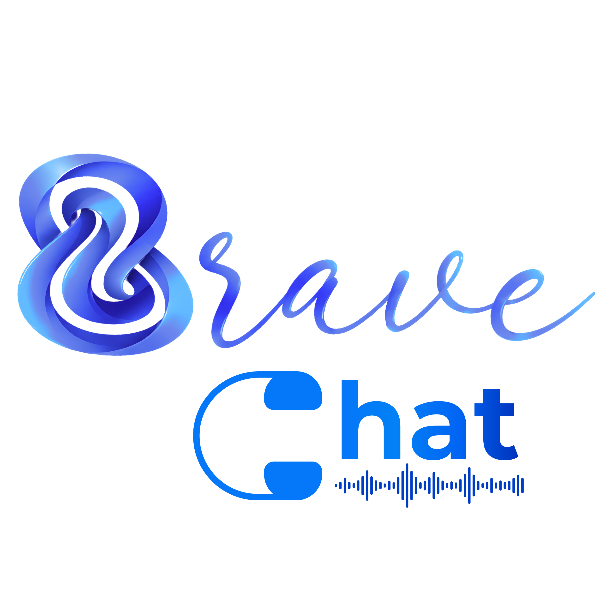
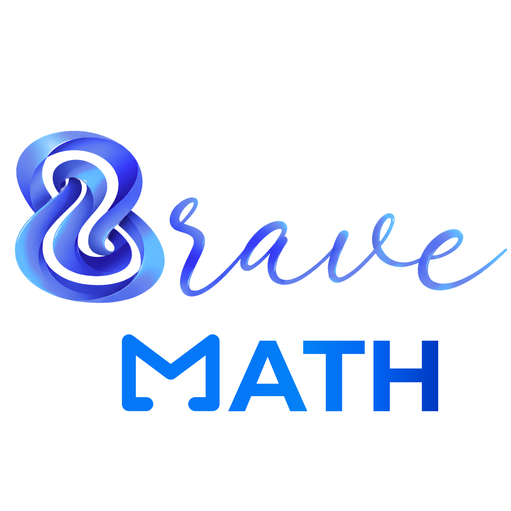

<h1>Bùi Quang Chiến (Brave 9)</h1>
<h3>Computer Science Student @ HUS-VNU | AI Engineer & Software Developer</h3>

&nbsp;

&nbsp;

<h3>Professional Summary</h3>

Hello! I am a Computer Science student at Hanoi University of Science - Vietnam National University (HUS-VNU). My technical expertise lies at the intersection of <b>Artificial Intelligence, Computer Vision, and Software Engineering</b>.

I approach AI problems with a rigorous mathematical foundation, diving deep into algorithms rather than relying solely on high-level APIs. Whether it is building end-to-end Machine Learning pipelines or implementing Computer Vision techniques from scratch, I focus on robustness and performance. Leveraging my strong background in Backend Development and System Architecture, I am highly capable of independently deploying complex AI models into scalable, real-world applications.

<b>Current Focus & Availability:</b>

<ul>
  <li><b>Computer Vision & Deep Learning:</b> Developing and optimizing algorithms using PyTorch and OpenCV.</li>
  <li><b>System Architecture:</b> Building scalable web applications, RESTful APIs, and real-time systems (Spring Boot, Fastify, Docker).</li>
  <li><b>Mathematical & Educational Content:</b> Authored over 300+ pages of high-quality Mathematics documents utilizing LaTeX and programmatic animations (Manim).</li>
  <li><b>Availability:</b> Fully available for <b>full-time and remote</b> opportunities, equipped with the independence and end-to-end skills required to contribute effectively to industrial projects.</li>
</ul>

<h3>Featured Projects</h3>
<table width="100%" style="border-collapse: collapse; border: none;">
  <tr>
    <td width="50%" valign="top" style="padding: 10px; border: 1px solid #444;">
      

        <!-- Hãy cho ảnh brave-chat.png vào thư mục assets trên repo Github của bạn -->
        
      

      <h3>Bravechat: Real-time Communication</h3>
      
A highly scalable, real-time messaging platform built with a Turborepo monorepo architecture. Designed comprehensive PostgreSQL schemas and implemented secure JWT-based authentication with refresh token rotation.

      
<b>Next.js | Fastify | PostgreSQL | Redis | Docker</b>

    </td>
    <td width="50%" valign="top" style="padding: 10px; border: 1px solid #444;">
      

        <!-- Hãy cho ảnh bravemath-logo.png vào thư mục assets trên repo Github của bạn -->
        
      

      <h3>BraveMath & LaTeX Math Ecosystem</h3>
      
An academic sharing platform featuring a serverless backend with Cloudflare Workers. It hosts over 300+ pages of advanced mathematics materials meticulously typeset in LaTeX and dynamic educational animations generated via Manim.

      
<b>Java | Spring Boot | Cloudflare Workers | LaTeX | Manim</b>

    </td>
  </tr>
  <tr>
    <td width="50%" valign="top" style="padding: 10px; border: 1px solid #444;">
      <h3>Computer Vision Algorithms & Pipelines</h3>
      
Extensive implementation of image processing fundamentals from scratch using NumPy. Includes an intelligent Waste Item Classification pipeline utilizing Transfer Learning (MobileNetV2) and a Support Vector Machine (SVM) classifier for optimized margin separation.

      
<b>Python | PyTorch | OpenCV | NumPy | scikit-image</b>

    </td>
    <td width="50%" valign="top" style="padding: 10px; border: 1px solid #444;">
      <h3>Student Performance Prediction (ML)</h3>
      
An end-to-end Machine Learning pipeline utilizing Exploratory Data Analysis (EDA), PCA/t-SNE dimensionality reduction, and clustering. Compared and fine-tuned models including XGBoost and Random Forest, yielding a comprehensive 28-page academic report.

      
<b>Python | XGBoost | scikit-learn | Pandas</b>

    </td>
  </tr>
</table>

<h3>Technical Proficiency</h3>

<b>Artificial Intelligence, Computer Vision & Data Science</b>

  

<b>Software Engineering, Backend & Infrastructure</b>

<h3>GitHub Analytics</h3>

&nbsp;

<h3>Contact Information</h3>
<ul>
  <li><b>Email:</b> bravechien2209@gmail.com</li>
  <li><b>LinkedIn:</b> <a href="https://www.linkedin.com/in/brave9/">https://www.linkedin.com/in/brave9/</a></li>
</ul>

I am currently open to full-time and remote roles in Artificial Intelligence, Computer Vision, and Software Engineering.

